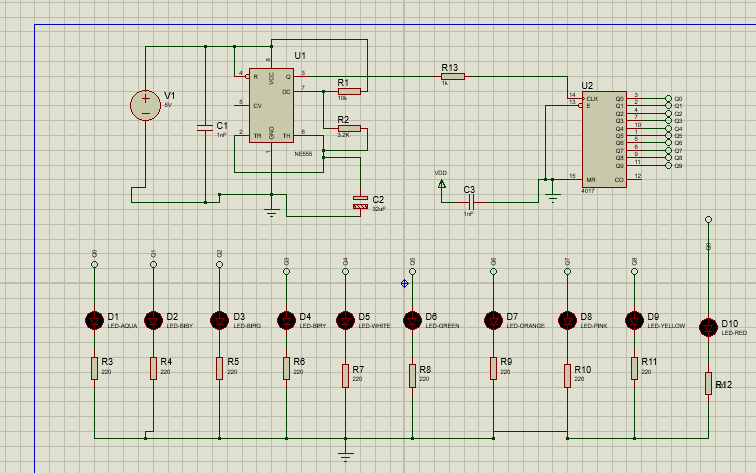

# ✨ LED Chaser PCB

A simple LED Chaser circuit designed and simulated in Proteus, with a custom PCB designed in KiCad.

This project demonstrates sequential LED blinking, making it a great beginner project for learning PCB design and electronic circuit simulation.

---

## Features

- Sequential LED chasing effect
- Custom PCB Design
- Proteus Simulation
- KiCad PCB Layout
- 3D PCB Preview
- Gerber Files Included

---

## Tools Used

- KiCad
- Proteus

---

## Project Preview

### Circuit Schematic



---

### PCB Layout


---

### 3D View


---

### Simulation


---

## Folder Structure

```text
Schematic/
PCB/
Proteus/
Documentation/
```

---

## Applications

- Electronics Learning
- PCB Design Practice
- Embedded Systems Training
- LED Animation Projects

---

## Future Improvements

- Adjustable Speed Control
- RGB LED Version
- Arduino-Controlled Chaser
- Sound-Reactive LED Chaser

---

## Author

**Ali Nawaz**

Electrical Engineering Student

GitHub: https://github.com/alisolangi1122345-cpu
